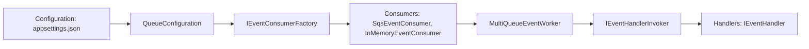

# EventBroker Solution

## Overview
EventBroker is a modular event processing framework designed for multi-queue scenarios. It supports:

- **MultiQueueEventWorker**: A single background service that polls multiple queues concurrently.
- **Dead Letter Queue (DLQ) Handling**: Failed messages are moved to DLQ with structured payloads and failure reasons.
- **Heartbeat Logging**: Logs a heartbeat every configurable interval to confirm the worker is alive.
- **Per-Queue Metrics**: Tracks processed and failed messages per queue, including failure reasons.
- **Minimal API Endpoints**: For health checks, status, queue info, and metrics.

## Architecture
```
+----------------------+       +----------------------+       +----------------------+
|   MultiQueueEvent    | ---> |    IEventConsumer    | ---> |   Transport Layer    |
|      Worker          |       | (SQS, InMemory, ...) |       | (AWS SQS, etc.)      |
+----------------------+       +----------------------+       +----------------------+
        | Metrics & Heartbeat
        v
   Minimal API Endpoints
```

### Architecture Flow


### Components
- **EventQueueWorker / MultiQueueEventWorker**: Polls queues, dispatches events, handles failures.
- **IEventConsumer**: Abstracts queue operations (fetch, DLQ, copy).
- **SqsEventConsumer**: AWS SQS implementation.
- **EventHandlerInvoker**: Invokes event handlers dynamically.

### Configuration Example
```json
{
  "Worker": {
    "HeartbeatIntervalSeconds": 300,
    "PollingIntervalSeconds": 5
  },
  "Queues": [
    {
      "Name": "Workday",
      "Url": "https://sqs.eu-central-1.amazonaws.com/041717511598/Workday",
      "DLQUrl": "https://sqs.eu-central-1.amazonaws.com/041717511598/Workday-DLQ"
    },
    {
      "Name": "SicsEvents",
      "Url": "https://sqs.eu-central-1.amazonaws.com/041717511598/Sics-Events",
      "DLQUrl": "https://sqs.eu-central-1.amazonaws.com/041717511598/Sics-DLQ"
    }
  ]
}
```

### Dependency Injection Setup
```csharp
// Bind Options from appsettings.json
builder.Services.Configure<WorkerPollingOptions>(builder.Configuration.GetSection("Worker"));
builder.Services.Configure<QueueConfiguration>(builder.Configuration.GetSection("Queues"));

// Register AWS SQS with profile
builder.Services.AddAwsSqsWithProfile("DevOps-Sandbox", RegionEndpoint.EUCentral1);

// Register AWS SQS factory
builder.Services.AddSingleton<IEventConsumerFactory, SqsEventConsumerFactory>();

// Register Event Broker Core services
builder.Services.AddEventCore(cfg =>
{
    cfg.RegisterSubscribers()
       .WithMessageSource("Workday.Publisher")
       .WithMessageContentLogging(true);
});

// Register MultiQueueEventWorker as Hosted Service
builder.Services.AddHostedService<MultiQueueEventWorker>();
```

## Minimal API Endpoints
```csharp
app.MapGet("/health", () => Results.Ok(new { Status = "Healthy", Timestamp = DateTime.UtcNow }));
app.MapGet("/ping", () => Results.Ok("pong"));
app.MapGet("/status", (IEnumerable<IEventConsumer> consumers) => Results.Ok(new
{
    Worker = "MultiQueueEventWorker",
    Queues = consumers.Select(c => c.QueueName),
    LastHeartbeat = MultiQueueMetrics.LastHeartbeat
}));
app.MapGet("/queues", (IEnumerable<IEventConsumer> consumers) => Results.Ok(consumers.Select(c => new
{
    QueueName = c.QueueName,
    Type = c.GetType().Name
})));
app.MapGet("/metrics", () => Results.Ok(new
{
    LastHeartbeat = MultiQueueMetrics.LastHeartbeat,
    Queues = MultiQueueMetrics.QueueStats.Select(q => new
    {
        QueueName = q.Key,
        Processed = q.Value.Processed,
        Failed = q.Value.Failed,
        FailureReasons = q.Value.FailureReasons.Select(r => new { Reason = r.Key, Count = r.Value })
    })
}));
```

## DLQ Handling
Failed messages are moved to DLQ with structured payload:
```json
{
  "OriginalMessage": "{...}",
  "FailureReason": "Handler failed",
  "OriginalQueue": "Workday",
  "Timestamp": "2025-11-21T18:45:00Z"
}
```

## Heartbeat
- Logs every 5 minutes (configurable).
- Updates `/metrics` endpoint with `LastHeartbeat`.

## Metrics
- Tracks processed and failed messages per queue.
- Includes failure reasons for troubleshooting.


## Implementing Event Handlers

Event handlers are responsible for processing events consumed from queues. Each handler must implement the generic interface:

```csharp
public interface IEventHandler<T>
{
    Task<EventProcessResult> HandleAsync(T request, CancellationToken cancellationToken);
}
```

### Responsibilities
- Deserialize the event payload into a strongly typed model.
- Perform business logic for the event.
- Return an `EventProcessResult` indicating success or failure.

### Example: WorksheetUpdatedHandler
```csharp
public partial class WorksheetUpdatedHandler : IEventHandler<CloudEvent<WorksheetUpdated>>
{
    private readonly ILogger<WorksheetUpdatedHandler> _logger;

    public WorksheetUpdatedHandler(ILogger<WorksheetUpdatedHandler> logger)
    {
        _logger = logger;
    }

    public async Task<EventProcessResult> HandleAsync(CloudEvent<WorksheetUpdated> request, CancellationToken cancellationToken)
    {
        try
        {
            var data = request.Data;
            LogProcessingStarted(request.Id);

            await Task.Delay(100, cancellationToken);
            LogProcessingSucceeded(request.Id);

            return OperationResult.Ok(request.Id);
        }
        catch (Exception ex)
        {
            LogProcessingFailed(request.Id, ex.Message);
            var error = (ex.InnerException ?? ex).Message;
            return new OperationResult(request.Id, error);
        }
    }

    [LoggerMessage(EventId = 600, Level = LogLevel.Information, Message = "Processing WorksheetUpdated for Id={Id}")]
    partial void LogProcessingStarted(string Id);

    [LoggerMessage(EventId = 601, Level = LogLevel.Information, Message = "WorksheetUpdated processed successfully for Id={Id}")]
    partial void LogProcessingSucceeded(string Id);

    [LoggerMessage(EventId = 602, Level = LogLevel.Error, Message = "Failed to process WorksheetUpdated for Id={Id}. Error={Error}")]
    partial void LogProcessingFailed(string Id, string Error);
}
```

### Example: S3EventNotificationHandler
```csharp
public partial class S3EventNotificationHandler : IEventHandler<S3EventNotification>
{
    private readonly ILogger<S3EventNotificationHandler> _logger;

    public S3EventNotificationHandler(ILogger<S3EventNotificationHandler> logger)
    {
        _logger = logger;
    }

    public async Task<EventProcessResult> HandleAsync(S3EventNotification request, CancellationToken cancellationToken)
    {
        try
        {
            foreach(var record in request.Records)
            {
                LogProcessingStarted(record.S3.Object.Key);

                await Task.Delay(100, cancellationToken);
                LogProcessingSucceeded(record.S3.Object.Key);
            }

            return OperationResult.Ok();
        }
        catch (Exception ex)
        {
            LogProcessingFailed("...", ex.Message);
            var error = (ex.InnerException ?? ex).Message;
            return OperationResult.Fail("...", error);
        }
    }

    [LoggerMessage(EventId = 600, Level = LogLevel.Information, Message = "Processing S3 event for Key={Id}")]
    partial void LogProcessingStarted(string Id);

    [LoggerMessage(EventId = 601, Level = LogLevel.Information, Message = "S3 event processed successfully for Key={Id}")]
    partial void LogProcessingSucceeded(string Id);

    [LoggerMessage(EventId = 602, Level = LogLevel.Error, Message = "Failed to process S3 event for Key={Id}. Error={Error}")]
    partial void LogProcessingFailed(string Id, string Error);
}
```

### Summary
- Handlers must implement `IEventHandler<T>` for the event type they process.
- Use structured logging with `LoggerMessage`.
- Return `EventProcessResult` to indicate success or failure.
